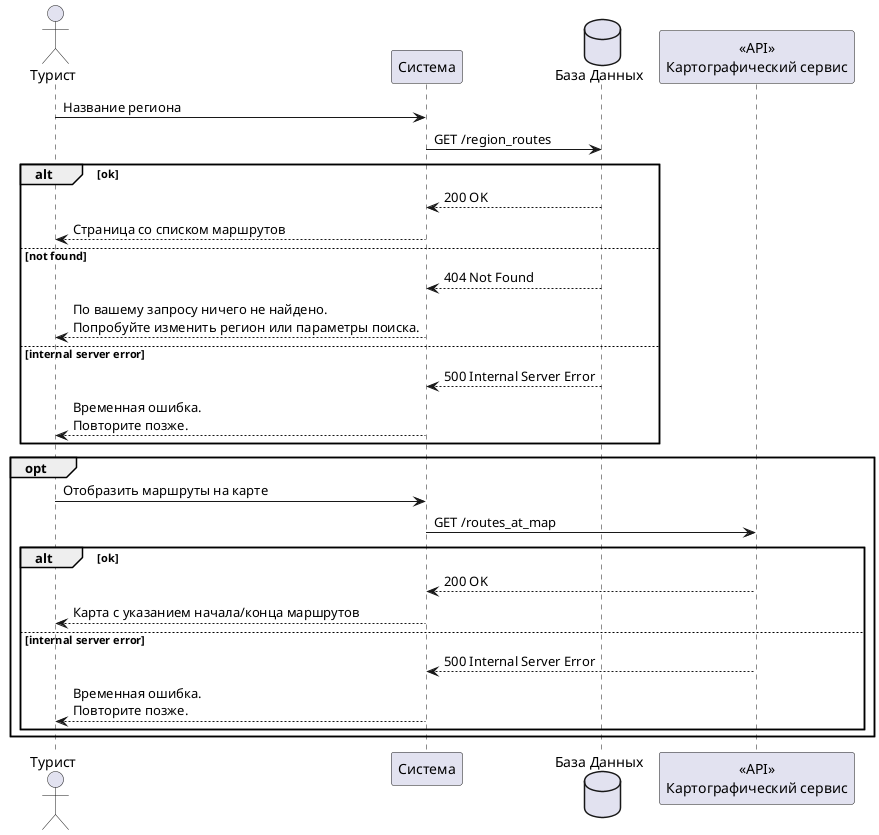

import Drawio from '@theme/Drawio'
import diagram from '!!raw-loader!./BPMN.drawio';

# Архитектура системы

В данном разделе представлены ключевые модели процессов, описывающие логику работы платформы **RussiaRoutes**. Основной акцент сделан на варианте использования **ВИ-1: «Найти маршрут по региону»** — одном из критически важных сценариев для туриста.

## BPMN-диаграмма процесса «Найти маршрут по региону»

Диаграмма бизнес-процесса построена в нотации BPMN 2.0 и отражает полный цикл поиска маршрутов: от ввода поискового запроса до отображения результатов с учётом контекстных рекомендаций и обработки ошибок.

<Drawio content={diagram} editable={false} />

> **Примечание:** Для корректного отображения диаграммы необходимо установить плагин для просмотра `.drawio` файлов в Docusaurus (например, `docusaurus-plugin-drawio`).

## DMN-правила (Decision Model and Notation)

Для обогащения поискового запроса и повышения релевантности выдачи используется таблица бизнес-правил. Правила применяются **после** ввода запроса, но **до** выполнения выборки из БД. Это позволяет динамически корректировать рекомендации без участия разработчиков.

### Таблица бизнес-правил

| № | Условие (поисковый запрос содержит) | Сезон | Праздник | Рекомендация |
| - | ----------------------------------- | ----- | -------- | ------------ |
| 1 | «байкал» | лето | любой | Байкал, пешие маршруты |
| 2 | «байкал» | зима | любой | Байкал, подлёдный дайвинг |
| 3 | «алтай» | лето | любой | Алтай, трекинг |
| 4 | «алтай» | зима | любой | Алтай, горные лыжи |
| 5 | «камчатка» | любой | любой | Камчатка, вулканы |
| 6 | «карелия» | любой | любой | Карелия, озёра, сплавы |
| 7 | «сочи» | лето | любой | Сочи, пляжный отдых |
| 8 | «сочи» | зима | любой | Красная Поляна, горные лыжи |
| 9 | «санкт-петербург» или «питер» | любой | любой | Санкт-Петербург, экскурсии |
| 10 | «москва» | любой | любой | Москва, культурная программа |
| 11 | «золотое кольцо» | любой | любой | Золотое кольцо, древние города |
| 12 | «горы» | лето | любой | Кавказ, трекинг |
| 13 | «море» | лето | любой | Краснодарский край, пляжи |
| 14 | (любой запрос) | любой | любой | общий поиск (если ничего не подошло) |

**Обоснование использования DMN:**
- Изменение популярности регионов и сезонных предложений требует оперативной корректировки. DMN позволяет аналитикам править рекомендации в runtime без переразвёртывания кода.
- Правила легко расширять: достаточно добавить новую строку в таблицу.

## UML-диаграмма последовательности (Sequence Diagram)

Диаграмма последовательности для варианта использования **ВИ-1: «Найти маршрут по региону»** показывает взаимодействие между актором (турист), пользовательским интерфейсом (UI), backend-сервисом, базой данных (БД) и внешним картографическим сервисом.

